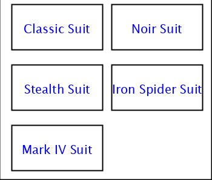
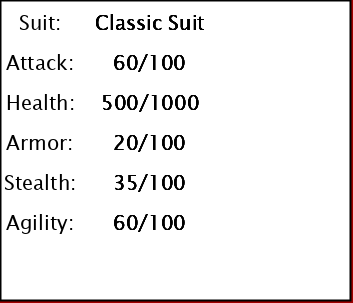
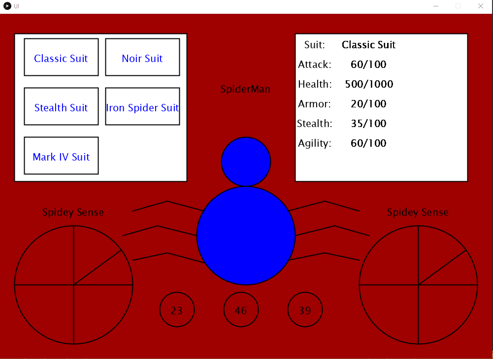

# SciFi UI Project

Name: Jerricho Juliano

Student Number: C17331306


# Description of the assignment
The Task of this assignment was to create a SciFi user interface using the knowledge we know from Java and Processing. I decided to go on a design that is somewhat related to spiderman since I thouroughly enjoy the movies. So I decided to go along with this theme in the end.

# Instructions
There is not much interactivity with the user interface as it is mainly just visual.

1)The 3 circles at the bottom of the screen represent the time and it constantly updates the time from the computer system

2)The radar at the bottom right corner and the spider in the middle of the screen are just drawings and have no interactivity.

3)The buttons at the top left of the screen shows the different buttons with types of suits and if it is clicked it shows the details of the suit (Health, Attack,Agility etc.) depending on what button is clicked.

# How it works
The spider in the middle of the screen was drawn by the use of a spider class and just simple processing references such as ellipse() and line(). The ellipse is use to create the head and the body while the lines are used to create the legs of the spider.

```Java
public void drawSpider() 
    {
        //Draw Head of Spider
        ui.fill(0,0,255);
        ui.ellipse(500, 300 , 100, 100);//(x,y,width,height)

        //Draw Body of Spider
        ui.ellipse(500, 450 , 200, 200);

        //Draw Left Legs of Spider
       
            ui.line(415,400,340,380);//x1,y1,x2,y2
            ui.line(340,380,270,400);

            ui.line(400,450,320,430);
            ui.line(320,430,250,450);

            ui.line(415,505,340,485);
            ui.line(340,485,270,500);

        //Draw Right Legs of Spider
            ui.line(585,400,660,380);//x1,y1,x2,y2
            ui.line(660,380,730,400);

            ui.line(600,450,680,430);
            ui.line(680,430,750,450);

            ui.line(585,500,660,485);
            ui.line(660,485,730,500);

    }	
```

The time at the bottom middle of the screen displays the current time from the computer system. Processing references is used (second(),minute(),hour() and are placed into variables which are updated every time the update() function runs. The Time are surrounded by circles just for design.

```Java
public void render()
    {
 	ui.circle(360,600,70);//x,y,size
        
        if (h < 10)
        {   
            
            ui.text("0" + h, x, y);
        }
        else
        {
            ui.text(h, x, y);
        }
    }

 public void update()
    {
        s = second();
        m = minute();
        h = hour();
    }
```

The tables located at the top left and right of the screen represent the different type of suits with their designated buttons. If a button is clicked it prints out the data for that specific suit. In order to achieve this a .csv file is created to hold data. Then I created two array lists to be populated. The loadSuits() method is use to simply populate the array. The printSuitInfo() method is use to print out all the data set of the specific suit. It passes a parameter 'j' and depending on what value prints out the data set to the UI. The
mouseClicked() is just use to give the Ui some interactivity. It calculates where the cursor is with the use of many 'if' statements. Depending on which if statement gets triggered then it gets the data set from the assigned index and sets the value(parameter) to the same value of the ndex which is then passed on to the printSuitInfo() to print out the data set.

```Java
    
    ArrayList<Suit> suits = new ArrayList<Suit>();
    ArrayList<Suit> suitInfo = new ArrayList<Suit>();
	
public void loadSuits()
    {
        Table table = loadTable("suits.csv", "header");
        for(TableRow tr : table.rows())
        {
            Suit a = new Suit(tr);
            suits.add(a);
            
        }   

    }

 public void printSuitInfo(int j)
    {   

        for (int i = 0; i < suits.size(); i++) {
            text(suits.get(j).getSuit(),750, 60);
            text(suits.get(j).getAttack(),750,100);
            text(suits.get(j).getHealth(),750,140);
            text(suits.get(j).getArmor(),750,180);
            text(suits.get(j).getStealth(),750,220);
            text(suits.get(j).getAgility(),750,260);
        }
    }

 public void mouseClicked()
    {
        

        //CHecks if mouse position is inside the rectangle containing buttons
        if(mouseX > 30 && mouseX < 380 && mouseY > 40 && mouseY < 340 )
        {
            //Checks if mouse position is within the range of Classic Suit
            if(mouseX > 50 && mouseX < 200 && mouseY > 50 && mouseY < 125 )
            {
               suitInfo.add(suits.get(0));
               val = 0;
            }
            //Checks if mouse position is within the range of Noir Suit
            if(mouseX > 215 && mouseX < 365 && mouseY > 50 && mouseY < 125 )
            {
                suitInfo.add(suits.get(1));
                val = 1;
                
            }
            //Checks if mouse position is within the range of Stealth Suit
            if(mouseX > 50 && mouseX < 200 && mouseY > 150 && mouseY < 225 )
            {
                suitInfo.add(suits.get(2));
                val = 2;
            }
            //Checks if mouse position is within the range of Iron Spider Suit
            if(mouseX > 215 && mouseX < 365 && mouseY > 150 && mouseY < 225 )
            {
                suitInfo.add(suits.get(3));
                val = 3;
            }
            //Checks if mouse position is within the range of Mark IV Suit
            if(mouseX > 50 && mouseX < 200 && mouseY > 250 && mouseY < 325 )
            {
                suitInfo.add(suits.get(4));
                val = 4;
            }
        }

    }
```



# What I am most proud of in the assignment
Even though the user interface is very basic and simplistic, I have grasped a decent understanding of how java and processing works. I'm not as proud of the assignment as I would like since I feel I should had put more work into it that it deserves.

However, the thing that I am proud is that I got a grasp of how java and processing works and have a decent understanding of its capabilites. The project was quite enjoyable especially that we had the option to base it off something that we have some interesting of.

# Images




# Youtube
(https://www.youtube.com/watch?v=zbsyCHQBzhA)


